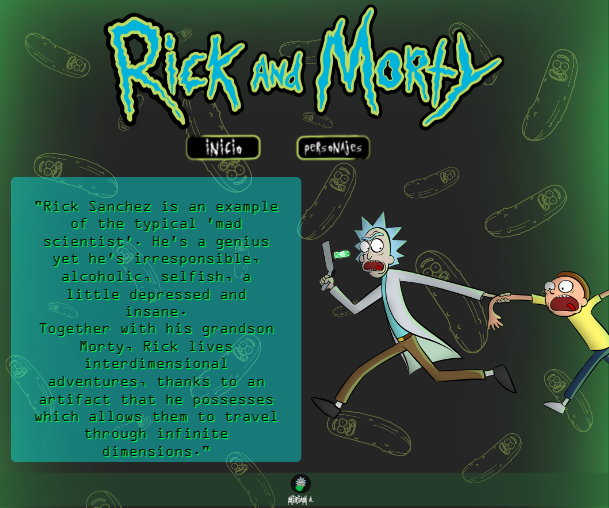
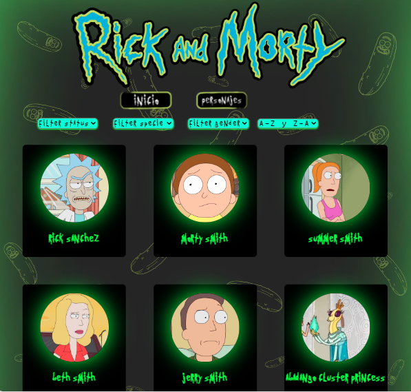
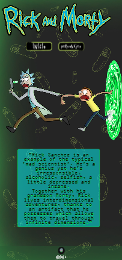
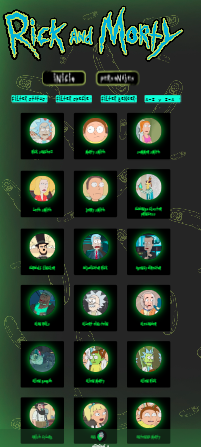

# Rick and Morty

## Descripción

Este proyecto es una aplicación web que muestra información detallada sobre los personajes de la serie de televisión "Rick and Morty". La aplicación permite a los usuarios explorar una lista de personajes, filtrarlos por estado, especie y género, así como ordenarlos alfabéticamente. Además, al hacer clic en cada personaje, se despliega una ventana modal con detalles específicos del personaje seleccionado.

## Características Principales

- **Visualización de Personajes:** Muestra tarjetas de personajes con su nombre e imagen.
- **Filtros:** Permite a los usuarios filtrar personajes por estado, especie y género.
- **Ordenamiento:** Facilita la ordenación de la lista de personajes en orden alfabético ascendente o descendente.
- **Detalles del Personaje:** Al hacer clic en un personaje, se muestra una ventana modal con detalles como estado, especie, género, origen y ubicación.

## Tecnologías Utilizadas

- **HTML, CSS y JavaScript:** Desarrollo de la interfaz de usuario y funcionalidad.
- **@media Queries:** Diseño responsivo, adaptando la interfaz a diferentes tamaños de pantalla.
- **Jest:** Pruebas unitarias para garantizar la funcionalidad correcta de las funciones.

## Vista de Escritorio

  
  

  
  

    

## Vista Móvil

  

  

## Pruebas Unitarias

El proyecto incluye pruebas unitarias escritas con Jest para garantizar la correcta funcionalidad de las funciones esenciales, como la obtención de datos, el filtrado y el ordenamiento de la lista de personajes.

[Enlace al Proyecto](https://miriamavalos.github.io/DEV008-Rick-and-Morty/) ✌️ 
